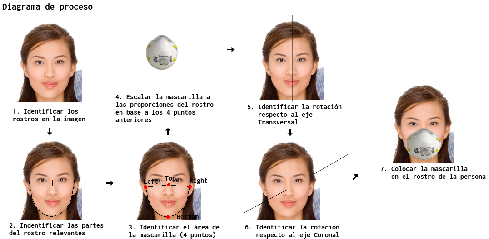

# Mask the Face

The present project has the aim to mask people from a photo of people who aren't wearing a mask, currently the algorithm follows these steps: 



## Prerequisites

This project is currently using `Python 3.9.1` and `pip 21.0`.

Clone this project and run the following commands in your terminal:

1. To setup a `Python` virtual environment:
    ```console
    $ python -m venv venv
    ```

2. Use the activate the `Python` virtual environment:
    ```console
    $ source venv/bin/activate
    ```

3. To install the requirements:
    ```console
    $ pip install -r requirements.txt
    ```
    Be aware of what is your `pip` version.

## Usage

In your terminal, run the following commands:

```console
$ python src/index.py
```

It will open your default image viewer with one of the three pictures in the `images/groups` folder. This picture will contain many faces each of which well have a face mask, which was set by the algorithm.

One you finish testing please run the following command to deactivate the virtual environment.

```console
$ deactivate
```

This will deactivate the `Python` virtual environment, so you will be able to use your global environment as usual.

## Author
-   **Anthony Luzquiños** - _Initial Work_ - _Documentation_ - [AnthonyLzq](https://github.com/AnthonyLzq).